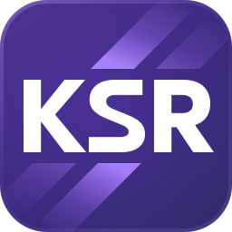

# Kusto Slice Runner (KSR)



Kusto Slice Runner is a local, developer-desktop system for scheduled Kusto
set-or-append jobs. It is designed for an authenticated user or service identity
that already has permission to execute the configured Kusto functions and append
to the configured output tables.

The job catalog, queue, slice history, operational logs, rerun reports, repair
state, and performance observations are stored in SQLite. Normal
execution-enabled instances also collect Kusto command statistics automatically
in the background. Query output stays in Kusto, and operational metadata is
stored locally.

KSR is intended for non-production scenarios, such as personal dashboards,
prototyping, and historical backfills into sample datasets. It is not a hosted
service or a production orchestration platform. See [SUPPORT.md](SUPPORT.md) for
questions and feedback.

## Features

- Execute time-sliced Kusto functions on a schedule and write results to Kusto
  tables.
- Track queue state, slice history, attempts, logs, failures, and success-rate
  charts.
- Visualize job dependencies as a graph. On demand, the graph can also resolve
  each job's Kusto lineage.
- Plan historical reruns and local state repair. Analyze failures with a Copilot
  button.
- Use Copilot skills in `.github/skills`: `ksr-job-manager` to drive the job API
  (import/upsert, pause/resume, soft-delete/restore, diagnostics),
  [`ksr-gap-repair`](.github/skills/ksr-gap-repair/SKILL.md) to fill job gaps,
  and `ksr-schedule-json` to author and validate job schedules.
- Periodically check GitHub (via the `gh` CLI) for a newer published Kusto Slice
  Runner release and shows an update badge in the top bar.

## Quick start from a release

After a public release is approved and published, open
[GitHub Releases](https://github.com/microsoft/kusto-slice-runner/releases) and
download one of these Windows x64 packages:

- `kusto-slice-runner-<version>-win-x64-self-contained.zip` includes the .NET
  runtime and is the easiest option.
- `kusto-slice-runner-<version>-win-x64-framework-dependent.zip` is smaller but
  requires the .NET 10 runtime.

Extract the ZIP to a stable folder. Sign in with Azure CLI for Kusto access,
then make the first start with scheduling disabled:

```powershell
az login
.\Start-KsrApp.ps1 -AppArguments '--Ksr:Scheduler:Enabled=false'
```

Open `http://127.0.0.1:5057`

## Screenshots

These screenshots use fictional retail jobs and generated local history. The
resolved lineage and failure analysis are illustrative fixture responses, not
live Kusto or Copilot results. See
[Recreating the screenshots](docs/screenshots.md) for the isolated capture
workflow.

Job overview:


Job detail:


Job dependencies with resolved Kusto lineage:


Activity:


Analyze failures with Copilot:


## Support and security

See [SUPPORT.md](SUPPORT.md), [SECURITY.md](SECURITY.md),
[CONTRIBUTING.md](CONTRIBUTING.md), and
[THIRD-PARTY-NOTICES.md](THIRD-PARTY-NOTICES.md).

This project has adopted the
[Microsoft Open Source Code of Conduct](https://opensource.microsoft.com/codeofconduct/).

**Do not report security vulnerabilities through public GitHub issues.** Report
them to the
[Microsoft Security Response Center](https://msrc.microsoft.com/create-report);
see [SECURITY.md](SECURITY.md) for the maintained reporting policy.

## Data and external services

The catalog, logs, and execution history are stored locally in SQLite. Execution
contacts the configured Kusto targets and collects command statistics into the
local database. Disabling `Ksr:Scheduler:Enabled` disables execution and its
background statistics collection; explicitly requested lineage resolution is a
separate Kusto read.

Optional update checks contact GitHub through `gh`; disable them with
`Ksr:UpdateCheck:Enabled=false`. User-triggered failure analysis sends job
identifiers, target/function/table names, timestamps, and secret-sanitized error
evidence to GitHub Copilot CLI. Secret redaction is not anonymization. Review
your organization's data-sharing policy before using it, or disable the feature
with `Ksr:CopilotAnalysis:Enabled=false`.

## License and third-party code

KSR's first-party source is licensed under [MIT](LICENSE.TXT). The repository
includes third-party Chart.js, Cytoscape.js, cytoscape-dagre, and marked browser
assets, including bundled transitive components. See [NOTICE](NOTICE) and
[THIRD-PARTY-NOTICES.md](THIRD-PARTY-NOTICES.md) for attribution and
dependencies. Third-party components retain their own licenses.

## Trademarks

This project may contain trademarks or logos for projects, products, or
services. Authorized use of Microsoft trademarks or logos is subject to and must
follow
[Microsoft's Trademark & Brand Guidelines](https://www.microsoft.com/en-us/legal/intellectualproperty/trademarks/usage/general).
Use of Microsoft trademarks or logos in modified versions of this project must
not cause confusion or imply Microsoft sponsorship. Any use of third-party
trademarks or logos are subject to those third-party's policies.
