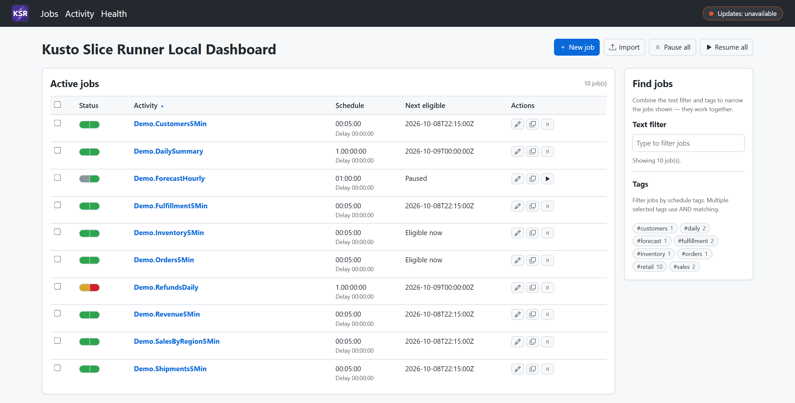
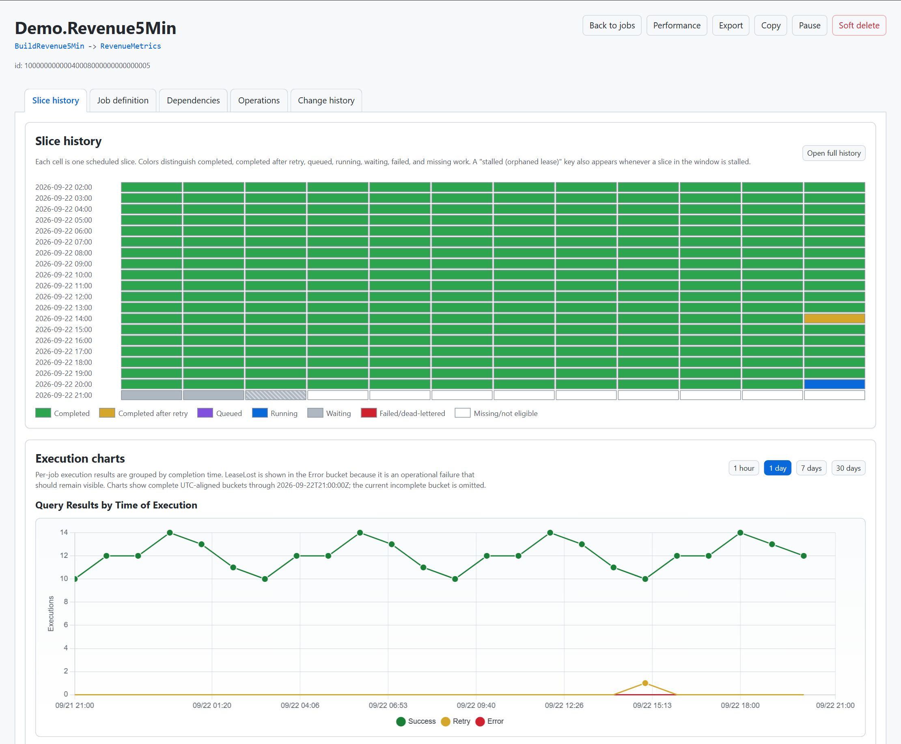
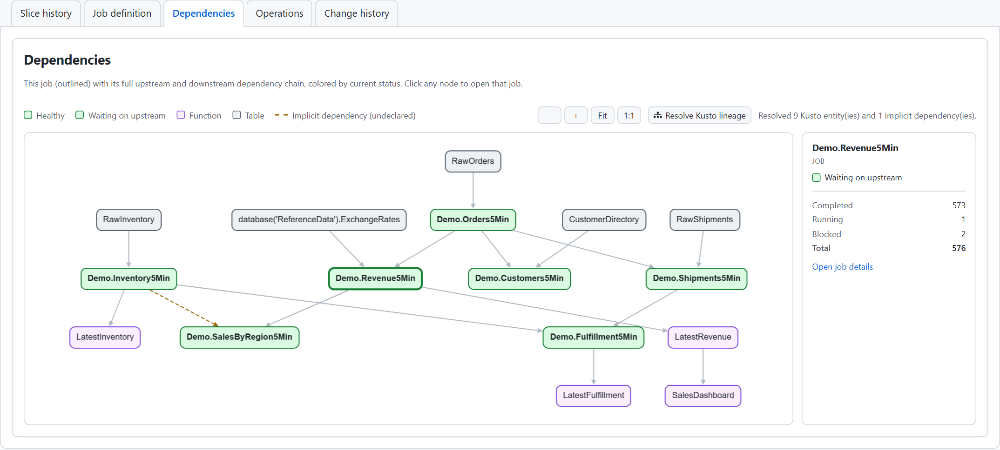
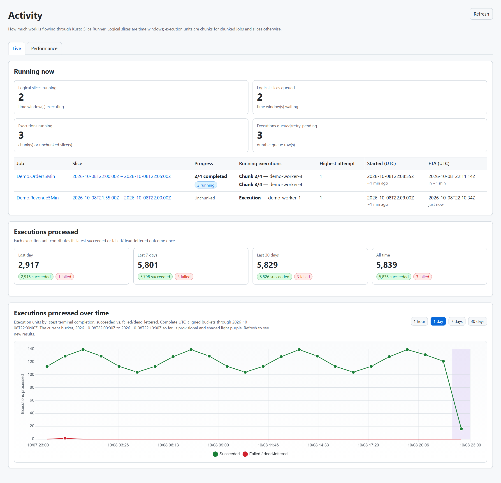
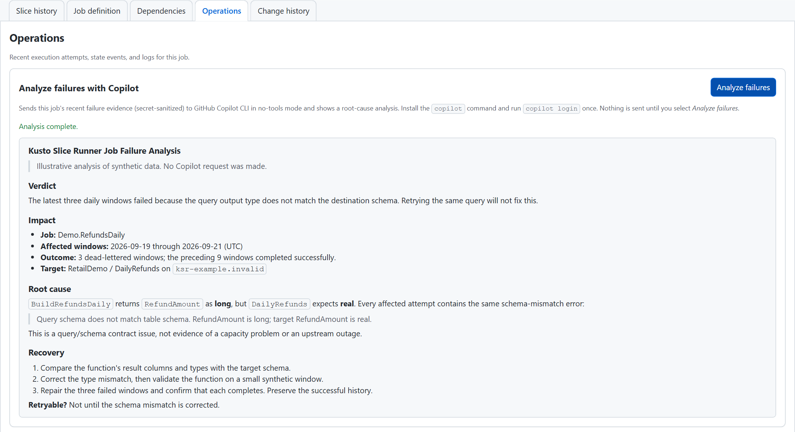

#  KO Lite

KO Lite is a local, developer-desktop system for scheduled Kusto set-or-append jobs. It is designed for an authenticated user or service identity that already has permission to execute the configured Kusto functions and append to the configured output tables.

The job catalog, queue, slice history, operational logs, rerun reports, and repair state are stored in in SQLite. Kusto is contacted only when scheduler/worker execution is enabled and a worker executes a slice. Data never leaves Kusto.

This is intended for non-production scenarios. For example, maybe you have a private dashboard that you want to schedule jobs for or you are working on a prototype that requires a bunch of backfilling to build up sample datasets. Those are great use cases for this tool. Down the road, it's plausible that the arch could be adjusted to be deployed to an Azure subscription. Feel free to contact me (23546948+benmartens@users.noreply.github.com) if you want to chat about that.

## Comparison with scheduled Kusto jobs

If you're familiar with [scheduled Kusto jobs](https://learn.microsoft.com/kusto/) here's a quick diff:
- The set of job features is simplified.
- Everything runs locally against a SQLite database. This is not meant for production scenarios.
- You can rerun slices! Click on any slice in the colorful window history view and then click "Rerun this slice" to get into that experience. This will properly handle dependent jobs too, but you'll need to make sure the Kusto tables are ready to accept the new data. KO Lite only reruns the jobs, it doesn't delete old data.
- You can both soft delete a job (keep the history to be resurrected in the future) or hard delete a job (permanently remove it and its history). Hard-delete avoids any problems around re-creating a job with the same id as a previous one.
- Pausing a job immediately blocks any future scheduling from happening. This includes retry loops! So when you pause a job, it will continue any in-flight set-or-append command but if that fails, it won't retry. After you unpause, it will pick up where it left off in the retry logic.
- Inside any job, open the Operations tab and click "Analyze failures" for a Copilot-written analysis of recent issues. It reuses your GitHub CLI sign-in to get access to powerful models without any extra resource deployments.
- You can visualize job dependencies and then also add Kusto functions and table schema depdendencies to the map.
- You can now add tags to your jobs and then filter them in the UI. This helps you handle multiple workstreams in a single instance.
- A combination of skills and an API make it easy to use GHCP to manage and maintain your jobs.

## What it does

- Executes Kusto functions on a schedule and writes results to Kusto tables.
- Schedules due time slices from enabled jobs into a local SQLite queue.
- Executes live Kusto `.set-or-append` commands for each claimed slice.
- Tracks queue state, slice history, attempts, logs, failures, and success-rate charts.
- Imports and exports strict schedule JSON for Kusto output jobs, including optional job organization tags.
- Shows active, completed, and soft-deleted jobs in a local dashboard.
- Summarizes each job with a compact **color-only status pill** (hover to learn more): a left half for **recent health** — green (healthy), amber (warning), red (attention) — that answers "is it working now?", plus, for strict jobs, a right half that flags **historical completeness** (red when unaddressed dead-lettered gaps exist, green when whole). The per-job `healthPolicy` (`complete` default, or `recent`) chooses whether old gaps are surfaced; `recent` jobs show a single solid capsule. See [docs/operations-runbook.md](docs/operations-runbook.md#dashboard-status-model).
- Visualizes job dependencies as a graph (colored by current job status) from a job's details page or by multi-selecting jobs on the dashboard and choosing "Dependencies". On demand, the graph can also resolve each job's Kusto lineage — the downstream functions/materialized views that consume its output, the upstream tables/functions it reads (including cross-cluster sources), and **implicit** (undeclared) dependencies where a job reads another KO job's output without declaring it.
- Shows an **Activity** page (`/activity`) with how many slices are running right now (including when each running slice started and an ETA for its finish based on the job's previous run times) and how many have been processed over time — a throughput chart plus succeeded vs. failed/dead-lettered totals for the last day, 7 days, 30 days, and all time.
- Bounds local database growth: a retention service prunes old operational telemetry (logs, terminal queue rows, old attempts) on a schedule while preserving the full slice window-history, so reruns and scheduling stay intact.
- Detects Kusto ingestion-capacity throttling (429), shows how bad it is (the % of attempts throttled, with a trend chart), highlights slices lost to throttling, and recommends per-job `maxParallelism` reductions that never starve a job below the parallelism it needs to keep up (and only trim a backfilling job to what still clears its backlog in time); operators apply them explicitly.
- Plans historical reruns and local state repair while leaving destructive Kusto cleanup to the operator.
- Exposes a localhost-only JSON API so a same-machine agent can read jobs, create/update schedules (via the same validated import path as the dashboard), and soft-delete/restore a job — plus a read-only **diagnostics** API for slice states, leases, throughput, history, logs, and audit.
- Ships **Copilot skills** in `.github/skills`: `ko-lite-job-manager` drives that API (import/upsert, pause/resume, soft-delete/restore, diagnostics), `ko-lite-schedule-json` authors and validates schedule JSON locally, `ko-lite-release-highlights` writes AI highlights for an existing release draft to a local Markdown file, and a `kusto` query helper.
- Periodically checks GitHub (via the `gh` CLI) for a newer published KO Lite release and shows an update badge in the top bar.

## Quick start from a release

Open the [latest GitHub Release](https://github.com/microsoft/kusto-slice-runner/releases/latest) and download one of these Windows x64 packages:

- `ko-lite-<version>-win-x64-self-contained.zip` includes the .NET runtime and is the easiest option.
- `ko-lite-<version>-win-x64-framework-dependent.zip` is smaller but requires the .NET 10 runtime.

Extract the ZIP to a stable folder. Sign in with Azure CLI for Kusto access, then make the first start with scheduling disabled:

```powershell
az login
.\Start-KoLiteApp.ps1 -AppArguments '--KoLite:Scheduler:Enabled=false'
```

Open `http://127.0.0.1:5057` and check `http://127.0.0.1:5057/status/health`. Review the configured jobs and Kusto targets before restarting without the scheduler override. The local catalog and execution history remain in `%LOCALAPPDATA%\KoLite\ko-lite.db`, outside the extracted application folder, so replacing the application folder does not replace your runtime state.

GitHub CLI is optional for basic execution but is required for the update badge and Copilot-powered failure analysis. Run `gh auth login` once to enable those features.

## Quick start from source

From the repository root:

```powershell
npm ci

dotnet run --project .\src\KoLite.LocalApp\KoLite.LocalApp.csproj
```

Open `http://127.0.0.1:5057` and check `http://127.0.0.1:5057/status/health`

You should be able to kill it at any point and it will restart without duplicating data (thanks to ingest-by tags) but to avoid any chance of issues, execute `scripts\Stop-KoLiteApp.ps1`. It will wait for the workers to drain and then shut down gracefully.

## Screenshots

Job overview:



Job detail:



Job dependencies with resolved Kusto lineage:



Activity:



Analyze failures with Copilot:



## Release highlights (maintainers)

After the GitHub Release workflow creates a draft, generate local AI highlights:

```powershell
pwsh -File .\scripts\New-KoLiteReleaseHighlights.ps1 -Version v1.1.0
```

The read-only script uses authenticated `gh` and Copilot CLI sessions to
summarize commits since the previous published release, then writes a Markdown
file. Review and paste that file into the draft manually. It never changes
GitHub and requires no PAT, repository secret, or organization-setting change.
See the [release guide](docs/releasing.md).

## Documentation

| Topic | Link |
| --- | --- |
| Architecture and component responsibilities | [Local-first architecture](docs/local-first-architecture.md) |
| Schedule JSON contract and import/export behavior | [Schedule JSON](docs/schedule-json.md) |
| Localhost API for agent-driven job management | [Local management API](docs/local-api.md) |
| Safe local runs, configuration, diagnostics, and reruns | [Operations runbook](docs/operations-runbook.md) |
| Repository layout, restore, build, and test commands | [Development guide](DEVELOPMENT.md) |
| Creating and reviewing GitHub Releases | [Release guide](docs/releasing.md) |
| Standalone repo validation checklist | [Release readiness checklist](docs/release-readiness-checklist.md) |

## Support and security

See [SUPPORT.md](SUPPORT.md), [SECURITY.md](SECURITY.md), [CONTRIBUTING.md](CONTRIBUTING.md), and [THIRD-PARTY-NOTICES.md](THIRD-PARTY-NOTICES.md).
